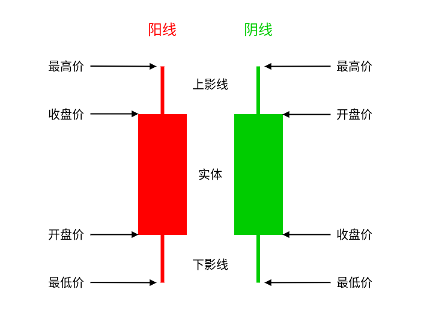
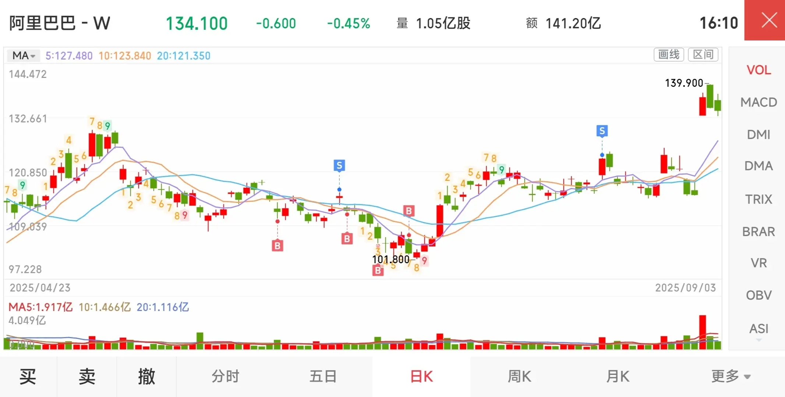
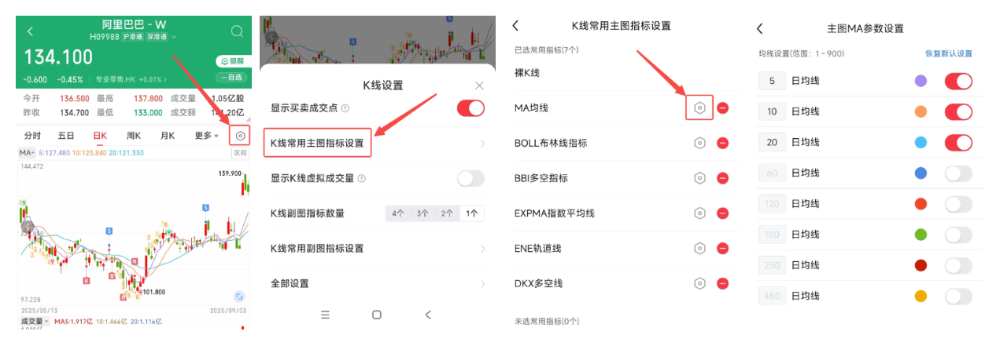

# 技术分析基础（K 线、均线、成交量、支撑与阻力位）

一旦开始炒股，你一定会从老股民那里听到 K 线、均线、成交量、支撑、阻力位…… 这些概念，结果往往是一头雾水：听懂了字面意思，却不明白到底怎么用。别急，其实这些东西并没有那么玄乎。它们只是一些“读图的工具”，帮助你看懂市场里资金的流动和情绪的变化。今天我们就来聊聊这几个常见的基础概念。

## K 线图：市场的“体温计”

**K 线图**，又叫“蜡烛图”，是股市里最常见的图表。K 线图最早起源于日本的米市交易，每一根 K 线代表一个时间周期（比如一天、一小时），根据上涨（收盘价 > 开盘价）或下跌（收盘价 < 开盘价）分为**阳线**（通常红色）和**阴线**（通常绿色）

每一根 K 线都包含四个数据：**开盘价、收盘价、最高价、最低价**。另外，**上影线、下影线** 表示盘中最高和最低价与实体的差距。

通过 K 线图，就可以很直观地看出一个时间周期内股价的变化情况。例如：一根长阳线，说明当天买盘力量强；一根带长上影线的 K 线，说明盘中冲高但被大量抛压打下来。

## 均线：市场的“平均情绪”

**均线**（Moving Average，简称 MA）又叫移动平均线，是将某一段时间内的收盘价之和取算术平均后的连线，你可以为一段时间内股价的平均值。常见的有 5 日均线、10 日均线、20 日均线…… **5 日均线** 就是最近 5 天的平均收盘价，以此类推。

均线画在 K 线图上后，你能看到股价的整体趋势。下图截取自华泰证券“涨乐财富通”App，图中显示阿里巴巴港股的日 K 线图，K 线图上覆盖的

如果看不到均线，或者想设置其他均线，例如 60 日均线。可以参考下面涨乐财富通 App 的设置方法，首先打开交易界面，选择任意股票，例如阿里巴巴-W；切换至日线图，点击右侧的设置按钮；选择“K线常用主图指标设置”，然后点击“MA均线”右侧的设置按钮；在主图MA参数设置页面可以开启或关闭 MA 均线，设置日均线参数，修改颜色等。

其他 App，如雪球、东方财富、富途牛牛、平安证券 App 等，设置方法大同小异，你可以自行摸索一下。

MA 均线是技术分析中的一个重要指标，可以反映市场的情绪。例如：当股价站在均线之上，说明短期走势强。下面详细介绍均线的作用和含义：

1. 上涨行情初期，股价在移动平均线上方运行，短期移动平均线上穿中长期移动平均线，形成黄金交叉，为买入信号。
2. 下跌行情初期，股价在移动平均线下方运行，短期移动平均线下穿中长期移动平均线，形成死亡交叉，为卖出信号。
3. 在下跌行情中，股价在移动平均线下方运行，反弹时未突破移动平均线，且移动平均线跌势减缓，趋于水平后又出现下跌趋势，为卖出信号。
4. 在上涨行情中，5日、10日、20日等移动平均线从上而下依次顺序排列，向右上方移动，称为“多头排列”，预示股价将大幅上涨。
5. 在下跌行情中，5日、10日、20日等移动平均线自下而上依次顺序排列，向右下方移动，称为“空头排列”，预示股价将大幅下跌。
6. 在上涨行情中，股价位于移动平均线之上，走多头排列的移动平均线可视为多方的防线，具有助涨作用。
7. 在下跌行情中，股价在移动平均线的下方，呈空头排列的移动平均线可视为空方的防线，真有助跌作用。
8. 股价位于移动平均线之上运行，数日大涨，离移动平均线太远，有可能回踩均线。
9. 股价位于移动平均线以下运行，突然暴跌，离移动平均线太远，有可能回抽均线。
10. 移动平均线从上升逐渐走平，而股价从移动平均线上方向下跌破移动平均线时说明卖压渐重，为卖出信号。

:::tip 温馨提示：

不要把均线当成万能的指示灯，因为它只是过去数据的平均，反应有滞后。而市场的变化永远无法准确预测。

:::

## 成交量：市场的“声音”

**成交量**就是某个时间段内成交的股票数量。在投资股票时，光看价格是不够的，还要看成交量。因为价格的涨跌如果没有成交量配合，往往没有说服力。例如，一只成交量很低的股票，其股价极易受突然的抛售或买入影响，造成剧烈波动。

下面是成交量的作用和含义：

- 股价上涨同时成交量放大（放量），说明很多人都在买，有大资金正在推动上涨，这时候趋势可能更可靠。
- 股价上涨但成交量萎缩，说明买盘力量不足，这时候趋势可能是假象。
- 股价下跌时放量，说明很多人在卖，意味着抛压大（没那么多人买），市场可能有恐慌。
- 如果价格波动很小，但成交量很大，说明买卖双方在激烈博弈。

你要记住一句话：**量在价先**。很多技术派都会把成交量看作验证价格走势的关键。你可以把成交量当作市场的“声音”，声音大，说明大家情绪激烈；声音小，说明市场比较冷清。建议散户优先选择“声音大”的股票，获利的机会更大，同时风险相对较小。

## 支撑与阻力位：市场的“心理关口”

- **支撑位**：股价下跌到某个价位时，不再继续跌，常常反弹。就像地板，往下摔到这里，暂时有托住的力量。
- **阻力位**：股价上涨到某个价位时，遇到卖压，难以上去。就像天花板，往上顶到这里，会被压下来。

支撑和阻力并不是固定的，而是市场中很多投资者心理共同作用的结果。有时候支撑位被跌破，反而会变成新的阻力位，这就是市场情绪转换的体现。

例如：一只股票曾多次在 10 元附近反弹，那么 10 元就可能是它的支撑位。

## 小结

技术分析并不是水晶球，不能帮你预测未来，但它能帮你看懂市场参与者的行为和心理。你可以先学会看 K 线和成交量，再慢慢结合均线、支撑位、阻力位。就像练习开车一样，熟能生巧，越看越有感觉。
